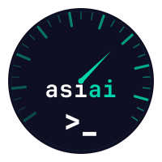

<p align="center">
  
</p>

<h1 align="center">asiai</h1>

<p align="center">
  <strong>Apple Silicon AI</strong> — Multi-engine LLM benchmark & monitoring CLI
</p>

<p align="center">
  <a href="https://pypi.org/project/asiai/"></a>
  <a href="https://github.com/druide67/asiai/actions/workflows/ci.yml"></a>
  <a href="https://codecov.io/gh/druide67/asiai"></a>
  <a href="LICENSE"></a>
  <a href="https://python.org"></a>
  <a href="https://support.apple.com/en-us/116943"></a>
  <a href="https://github.com/sponsors/druide67"></a>
  <a href="https://api.asiai.dev/api/v1/badge/benchmarks"></a>
  <a href="https://api.asiai.dev/api/v1/badge/top-speed"></a>
</p>

**asiai** compares inference engines side-by-side on your Mac. Load the same model on Ollama and LM Studio, run `asiai bench`, get the numbers. No guessing, no vibes — just tok/s, TTFT, power efficiency, and stability per engine.

Share your results with the community (`--share`), compare against other Apple Silicon users (`asiai compare`), and get smart engine recommendations (`asiai recommend`).

Born from the OpenClaw project, where we needed hard data to pick the fastest engine for multi-agent swarms on Mac Mini M4 Pro.

## Quick start

```bash
pipx install asiai        # Recommended: isolated install
```

Or via Homebrew:

```bash
brew tap druide67/tap
brew install asiai
```

Other options:

```bash
uvx asiai detect           # Run without installing (requires uv)
pip install asiai           # Standard pip install
```

Then benchmark and share:

```bash
asiai bench --quick --card --share    # Bench + shareable card in ~15 seconds
```

## Commands

### `asiai detect`

Auto-detect running inference engines across 6 ports.

```
$ asiai detect

Detected engines:

  ● ollama 0.17.4
    URL: http://localhost:11434

  ● lmstudio 0.4.5
    URL: http://localhost:1234
    Running: 1 model(s)
      - qwen3.5-35b-a3b  MLX
```

### `asiai bench`

Cross-engine benchmark with standardized prompts. Runs 3 iterations per prompt by default, reports median tok/s (SPEC standard) with stability classification.

```
$ asiai bench -m qwen3.5 --runs 3 --power

  Mac Mini M4 Pro — Apple M4 Pro  RAM: 64.0 GB (42% used)  Pressure: normal

Benchmark: qwen3.5

  Engine       tok/s (±stddev)    Tokens   Duration     TTFT       VRAM    Thermal
  ────────── ───────────────── ───────── ────────── ──────── ────────── ──────────
  lmstudio    72.6 ± 0.0 (stable)   435    6.20s    0.28s        —    nominal
  ollama      30.4 ± 0.1 (stable)   448   15.28s    0.25s   26.0 GB   nominal

  Winner: lmstudio (2.4x faster)
  Power: lmstudio 13.2W (5.52 tok/s/W) — ollama 16.0W (1.89 tok/s/W)
```

Options:

```
-m, --model MODEL          Model to benchmark (default: auto-detect)
-e, --engines LIST         Filter engines (e.g. ollama,lmstudio,mlxlm)
-p, --prompts LIST         Prompt types: code, tool_call, reasoning, long_gen
-r, --runs N               Runs per prompt (default: 3, for median + stddev)
    --power                Measure GPU power via powermetrics (sudo required)
    --context-size SIZE    Context fill prompt: 4k, 16k, 32k, 64k
    --share                Share results with the community (anonymous, opt-in)
-Q, --quick                Quick benchmark: 1 prompt, 1 run (~15 seconds)
    --card                 Generate shareable benchmark card (SVG + PNG with --share)
-H, --history PERIOD       Show past benchmarks (e.g. 7d, 24h)
```

The runner resolves model names across engines automatically — `gemma2:9b` (Ollama) and `gemma-2-9b` (LM Studio) are matched as the same model.

### `asiai models`

List loaded models across all engines. Use `--json` for machine-readable output.

```
$ asiai models

ollama  http://localhost:11434
  ● qwen3.5:35b-a3b                             26.0 GB Q4_K_M

lmstudio  http://localhost:1234
  ● qwen3.5-35b-a3b                                 MLX
```

### `asiai monitor`

System and inference metrics snapshot, stored in SQLite. Use `--json` for machine-readable output.

```
$ asiai monitor

System
  Uptime:    3d 12h
  CPU Load:  2.45 / 3.12 / 2.89  (1m / 5m / 15m)
  Memory:    45.2 GB / 64.0 GB  71%
  Pressure:  normal
  Thermal:   nominal  (100%)

Inference  ollama 0.17.4
  Models loaded: 1  VRAM total: 26.0 GB

  Model                                        VRAM   Format  Quant
  ──────────────────────────────────────── ────────── ──────── ──────
  qwen3.5:35b-a3b                            26.0 GB     gguf Q4_K_M
```

Options:

```
-w, --watch SEC            Refresh every SEC seconds
-q, --quiet                Collect and store without output (for daemon use)
    --json                 Output as JSON (for scripting)
-H, --history PERIOD       Show history (e.g. 24h, 1h)
-a, --analyze HOURS        Comprehensive analysis with trends
-c, --compare TS TS        Compare two timestamps
    --alert-webhook URL    POST alerts on state transitions (memory, thermal, engine down)
```

### `asiai doctor`

Diagnose installation, engines, system health, and database.

```
$ asiai doctor

Doctor

  System
    ✓ Apple Silicon       Mac Mini M4 Pro — Apple M4 Pro
    ✓ RAM                 64 GB total, 42% used
    ✓ Memory pressure     normal
    ✓ Thermal             nominal (100%)

  Engine
    ✓ Ollama              v0.17.4 — 1 model(s): qwen3.5:35b-a3b
    ✓ LM Studio           v0.4.5 — 1 model(s): qwen3.5-35b-a3b
    ✗ mlx-lm              not installed
    ✗ llama.cpp            not installed
    ✗ vllm-mlx            not installed

  Database
    ✓ SQLite              2.4 MB, last entry: 1m ago

  5 ok, 0 warning(s), 3 failed
```

### `asiai daemon`

Background monitoring via macOS launchd. Collects metrics every minute.

```bash
asiai daemon start              # Install and start the daemon
asiai daemon start --interval 30  # Custom interval (seconds)
asiai daemon status             # Check if running
asiai daemon logs               # View recent logs
asiai daemon stop               # Stop and uninstall
```

### `asiai web`

Web dashboard with real-time monitoring, benchmark controls, and interactive charts. Requires `pip install asiai[web]`.

```bash
asiai web                    # Opens browser at http://127.0.0.1:8899
asiai web --port 9000        # Custom port
asiai web --host 0.0.0.0     # Listen on all interfaces
asiai web --no-open          # Don't auto-open browser
```

Features: system overview, engine status, live benchmark with SSE progress, history charts, doctor checks, dark/light theme.

### `asiai leaderboard`

Browse community benchmarks. Filter by chip or model.

```bash
asiai leaderboard                      # All results
asiai leaderboard --chip "M4 Pro"      # Filter by chip
asiai leaderboard --model qwen2.5      # Filter by model
```

### `asiai compare`

Compare your local results against community medians.

```bash
asiai compare --chip "Apple M1 Max" --model qwen2.5:7b
```

### `asiai recommend`

Get engine recommendations based on your hardware and benchmarks.

```bash
asiai recommend                                # Best engine for your Mac
asiai recommend --use-case latency             # Optimize for TTFT
asiai recommend --model qwen2.5 --community    # Include community data
```

### `asiai setup`

Interactive setup wizard — detects hardware, engines, models, and suggests next steps.

```bash
asiai setup
```

### `asiai mcp`

Start the MCP server for AI agent integration. 11 tools, 3 resources.

```bash
asiai mcp                          # stdio (Claude Code, Cursor)
asiai mcp --transport sse          # SSE (network agents)
```

### `asiai tui`

Interactive terminal dashboard with auto-refresh. Requires `pip install asiai[tui]`.

```bash
asiai tui
```

## Benchmark Card — share your results

Generate a shareable benchmark card image with one flag:

```bash
asiai bench --card                    # SVG saved locally (zero dependencies)
asiai bench --card --share            # SVG + PNG via community API
asiai bench --quick --card --share    # Quick bench + card + share
```

A **1200x630 dark-themed card** with your model, chip, engine comparison bar chart, winner highlight, and metric chips. Optimized for Reddit, X, Discord, and GitHub READMEs.

Every shared card includes asiai branding — the [Speedtest.net model](https://www.speedtest.net) for local LLM inference.

## Supported engines

| Engine | Port | Install | API |
|--------|------|---------|-----|
| [Ollama](https://ollama.com) | 11434 | `brew install ollama` | Native |
| [LM Studio](https://lmstudio.ai) | 1234 | `brew install --cask lm-studio` | OpenAI-compatible |
| [mlx-lm](https://github.com/ml-explore/mlx-examples) | 8080 | `brew install mlx-lm` | OpenAI-compatible |
| [llama.cpp](https://github.com/ggml-org/llama.cpp) | 8080 | `brew install llama.cpp` | OpenAI-compatible |
| [vllm-mlx](https://github.com/vllm-project/vllm) | 8000 | `pip install vllm-mlx` | OpenAI-compatible |
| [Exo](https://github.com/exo-explore/exo) | 52415 | `pip install exo` | OpenAI-compatible |

## What it measures

| Metric | Description |
|--------|-------------|
| **tok/s** | Generation speed (tokens/sec), excluding prompt processing (TTFT) |
| **TTFT** | Time to first token — prompt processing latency |
| **Power** | GPU power draw in watts (`sudo powermetrics`) |
| **tok/s/W** | Energy efficiency — tokens per second per watt |
| **Stability** | Run-to-run variance: stable (CV<5%), variable (<10%), unstable (>10%) |
| **VRAM** | GPU memory footprint (Ollama, LM Studio via `lms` CLI) |
| **Thermal** | CPU throttling state and speed limit percentage |

All metrics stored in SQLite (`~/.local/share/asiai/metrics.db`) with 90-day retention and automatic regression detection.

## Benchmark methodology

Following [MLPerf](https://mlcommons.org/benchmarks/inference-server/), [SPEC CPU 2017](https://www.spec.org/cpu2017/), and [NVIDIA GenAI-Perf](https://docs.nvidia.com/deeplearning/nemo/user-guide/docs/en/stable/benchmarking/genai_perf.html) standards:

- **Warmup**: 1 non-timed generation per engine before measured runs
- **Runs**: 3 iterations per prompt (configurable), median as primary metric
- **Sampling**: `temperature=0` (greedy decoding) for deterministic results
- **Power**: Per-engine monitoring (not session-wide average)
- **Variance**: Pooled intra-prompt stddev (isolates run-to-run noise)
- **Metadata**: Engine version, model quantization, hardware chip, macOS version stored per result

See [docs/benchmark-best-practices.md](docs/benchmark-best-practices.md) for the full conformance audit.

## Benchmark prompts

Four standardized prompts test different generation patterns:

| Name | Tokens | Tests |
|------|--------|-------|
| `code` | 512 | Structured code generation (BST in Python) |
| `tool_call` | 256 | JSON function calling / instruction following |
| `reasoning` | 384 | Multi-step math problem |
| `long_gen` | 1024 | Sustained throughput (bash script) |

Use `--context-size 4k|16k|32k|64k` to test with large context fill prompts instead.

## API & Prometheus

When running `asiai web`, three REST API endpoints are available for programmatic access. Interactive API documentation (Swagger UI) is available at `http://localhost:8899/docs`.

| Endpoint | Description |
|----------|-------------|
| `GET /api/status` | Lightweight health check (< 500ms) — engine reachability, memory pressure, thermal |
| `GET /api/snapshot` | Full system + engine snapshot with loaded models, VRAM, versions |
| `GET /api/metrics` | Prometheus exposition format — 15 gauges for system, engines, models, benchmarks |

### Prometheus integration

```yaml
# prometheus.yml
scrape_configs:
  - job_name: 'asiai'
    static_configs:
      - targets: ['localhost:8899']
    metrics_path: '/api/metrics'
    scrape_interval: 30s
```

### CLI JSON output

```bash
asiai monitor --json | jq '.mem_pressure'
asiai models --json | jq '.engines[].models[].name'
```

## Requirements

- macOS on Apple Silicon (M1 / M2 / M3 / M4 families)
- Python 3.11+
- At least one inference engine running locally

## Zero dependencies

The core uses only the Python standard library — `urllib`, `sqlite3`, `subprocess`, `argparse`. No `requests`, no `psutil`, no `rich`. Just stdlib.

Optional extras:
- `asiai[web]` — FastAPI web dashboard with charts
- `asiai[tui]` — Textual terminal dashboard
- `asiai[all]` — Web + TUI
- `asiai[dev]` — pytest, ruff

## Roadmap

| Version | Scope | Status |
|---------|-------|--------|
| **v0.1** | detect + bench + monitor + models (CLI, stdlib) | **Done** |
| **v0.2** | mlx-lm + doctor + daemon + TUI (Textual) | **Done** |
| **v0.3** | 5 engines, power metrics, multi-run variance, regression detection | **Done** |
| **v0.4** | CI, MkDocs, export JSON, thermal drift, web dashboard | **Done** |
| **v0.5** | REST API, Prometheus /metrics, CLI --json, engine uptime tracking | **Done** |
| **v0.6** | Multi-service LaunchAgent (`daemon start web`), daemon status/logs/stop --all | **Done** |
| **v0.7** | Alert webhooks, LM Studio VRAM, Ollama config in doctor | **Done** |
| **v1.0** | Community Benchmark DB, smart recommendations, Exo engine, leaderboard | **Done** |
| **v1.0.1** | MCP server (11 tools), benchmark card, `--quick` mode, setup wizard, agent integration | **Done** |
| v1.1 | Fleet mode (multi-Mac), notifications macOS, MCP prompts, VRAM predictor | Planned |

## License

Apache 2.0
