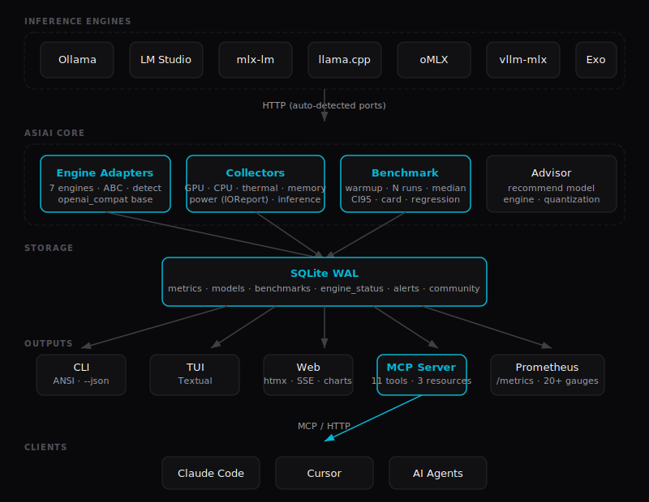

# Architektur

Wie Daten durch asiai fließen — von Hardware-Sensoren zu Ihrem Terminal, Browser und KI-Agenten.

## Überblick



## Wichtige Dateien

| Schicht | Dateien | Rolle |
|---------|---------|-------|
| **Engines** | `src/asiai/engines/` | ABC `InferenceEngine` + 7 Adapter (Ollama, LM Studio, mlx-lm, llama.cpp, oMLX, vllm-mlx, Exo). Basisklasse `OpenAICompatEngine` für OpenAI-kompatible Engines. |
| **Kollektoren** | `src/asiai/collectors/` | Systemmetriken: `gpu.py` (ioreg), `system.py` (CPU, Speicher, Thermal), `processes.py` (Inferenzaktivität via lsof). |
| **Benchmark** | `src/asiai/benchmark/` | `runner.py` (Warmup + N Durchläufe, Median, Stddev, CI95), `prompts.py` (Testprompts), `card.py` (SVG-Kartenerzeugung). |
| **Speicherung** | `src/asiai/storage/` | `db.py` (SQLite WAL, gesamtes CRUD), `schema.py` (Tabellen + Migrationen). |
| **CLI** | `src/asiai/cli.py` | Argparse-Einstiegspunkt, alle 12 Befehle. |
| **Web** | `src/asiai/web/` | FastAPI + htmx + SSE + ApexCharts-Dashboard. Routen in `routes/`. |
| **MCP** | `src/asiai/mcp/` | FastMCP-Server, 11 Tools + 3 Ressourcen. Transporte: stdio, SSE, streamable-http. |
| **Berater** | `src/asiai/advisor/` | Hardwareangepasste Empfehlungen (Modellgrößen, Engine-Auswahl). |
| **Anzeige** | `src/asiai/display/` | ANSI-Formatierer (`formatters.py`), CLI-Renderer (`cli_renderer.py`), TUI (`tui.py`). |

## Datenfluss

### Monitoring (Daemon-Modus)

```
Alle 60s:
  Kollektoren → Snapshot-Dict → store_snapshot(db) → Tabelle models
                                                    → Tabelle metrics
  Engines     → Engine-Status  → store_engine_status(db)
```

### Benchmark

```
CLI --bench → Engines erkennen → Modell wählen → Warmup → N Durchläufe
           → Median/Stddev/CI95 berechnen → store_benchmark(db)
           → Tabelle rendern (ANSI oder JSON)
           → optional: --share → POST an Community-API
           → optional: --card  → SVG-Karte generieren
```

### Web-Dashboard

```
Browser → FastAPI → Jinja2-Template (initiales Rendering)
       → htmx SSE → /api/v1/stream → Echtzeit-Updates
       → ApexCharts → /api/v1/metrics?hours=N → historische Graphen
```

### MCP-Server

```
KI-Agent → stdio/SSE/HTTP → FastMCP → Tool-Aufruf
        → führt Kollektor/Benchmark im Thread-Pool aus (asyncio.to_thread)
        → gibt strukturiertes JSON zurück
```

## Designprinzipien

1. **Null Abhängigkeiten für den Kern** — CLI, Kollektoren, Engines, Speicherung verwenden nur die Python-Standardbibliothek. Optionale Extras (`[web]`, `[tui]`, `[mcp]`) fügen Abhängigkeiten nur bei Bedarf hinzu.
2. **Gemeinsame Datenschicht** — Dieselbe SQLite-Datenbank bedient CLI, Web, MCP und Prometheus. Keine separaten Datenspeicher.
3. **Adapter-Pattern** — Alle 7 Engines implementieren das ABC `InferenceEngine`. Eine neue Engine hinzufügen = 1 Datei + Registrierung in `detect.py`.
4. **Lazy Imports** — Jeder CLI-Befehl importiert seine Abhängigkeiten lokal, um die Startzeit kurz zu halten.
5. **macOS-nativ** — `ioreg` für GPU, `launchd` für Daemons, `lsof` für Inferenzaktivität. Keine Linux-Abstraktionen.
