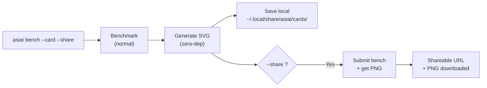

# Benchmark-Karte

Teilen Sie Ihre Benchmark-Ergebnisse als schönes, gebrandetes Bild. Ein einziger Befehl generiert eine Karte, die Sie auf Reddit, X, Discord oder jeder sozialen Plattform posten können.

## Schnellstart

```bash
asiai bench --quick --card --share    # Bench + Karte + Teilen in ~15 Sekunden
asiai bench --card --share            # Vollständiger Bench + Karte + Teilen
asiai bench --card                    # SVG + PNG lokal gespeichert
```

## Beispiel


## Was Sie erhalten

Eine **1200x630 Karte im dunklen Design** (OG-Image-Format, optimiert für soziale Medien) mit:

- **Hardware-Badge** — Ihr Apple-Silicon-Chip prominent dargestellt (oben rechts)
- **Modellname** — welches Modell benchmarkt wurde
- **Engine-Vergleich** — Terminal-Stil-Balkendiagramm mit tok/s pro Engine
- **Gewinner-Hervorhebung** — welche Engine schneller ist und um wie viel
- **Metrik-Chips** — tok/s, TTFT, Stabilitätsbewertung, VRAM-Nutzung
- **asiai-Branding** — Logo + „asiai.dev"-Badge

Das Format ist für maximale Lesbarkeit als Thumbnail auf Reddit, X oder Discord konzipiert.

## Wie es funktioniert



### Lokaler Modus (Standard)

SVG wird lokal mit **null Abhängigkeiten** generiert — kein Pillow, kein Cairo, kein ImageMagick. Reines Python-String-Templating. Funktioniert offline.

Karten werden in `~/.local/share/asiai/cards/` gespeichert. SVG eignet sich perfekt für lokale Vorschau, aber **Reddit, X und Discord benötigen PNG** — fügen Sie `--share` hinzu, um ein PNG und eine teilbare URL zu erhalten.

### Teilen-Modus

In Kombination mit `--share` wird der Benchmark an die Community-API übermittelt, die serverseitig eine PNG-Version generiert. Sie erhalten:

- Eine **PNG-Datei**, lokal heruntergeladen
- Eine **teilbare URL** unter `asiai.dev/card/{submission_id}`

## Anwendungsfälle

### Reddit / r/LocalLLaMA

> „Gerade Qwen 3.5 auf meinem M4 Pro getestet — LM Studio 2.4x schneller als Ollama"
> *[Kartenbild anhängen]*

Benchmark-Posts mit Bildern erhalten **5-10x mehr Engagement** als reine Textposts.

### X / Twitter

Das 1200x630-Format ist exakt die OG-Image-Größe — es wird perfekt als Kartenvorschau in Tweets angezeigt.

### Discord / Slack

Legen Sie das PNG in einem beliebigen Kanal ab. Das dunkle Design gewährleistet Lesbarkeit auf Dark-Mode-Plattformen.

### GitHub README

Zeigen Sie Ihre persönlichen Benchmark-Ergebnisse in Ihrem GitHub-Profil-README:

```markdown

```

## Kombinieren mit --quick

Für schnelles Teilen:

```bash
asiai bench -Q --card --share
```

Dies führt einen einzelnen Prompt aus (~15 Sekunden), generiert die Karte und teilt sie — perfekt für schnelle Vergleiche nach der Installation eines neuen Modells oder dem Upgrade einer Engine.

## Design-Philosophie

Jede geteilte Karte enthält das asiai-Branding. Dies erzeugt eine **virale Schleife**:

1. Benutzer benchmarkt seinen Mac
2. Benutzer teilt die Karte in sozialen Medien
3. Betrachter sehen die gebrandete Karte
4. Betrachter entdecken asiai
5. Neue Benutzer benchmarken und teilen ihre eigenen Karten

Das ist das [Speedtest.net-Modell](https://www.speedtest.net), adaptiert für lokale LLM-Inferenz.
