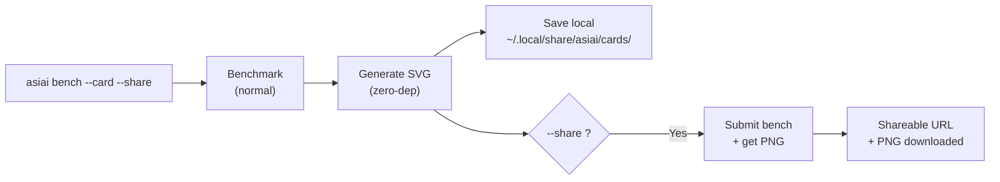

# Tarjeta de benchmark

Comparte tus resultados de benchmark como una imagen atractiva y con marca. Un solo comando genera una tarjeta que puedes publicar en Reddit, X, Discord o cualquier plataforma social.

## Inicio rápido

```bash
asiai bench --quick --card --share    # Bench + tarjeta + compartir en ~15 segundos
asiai bench --card --share            # Bench completo + tarjeta + compartir
asiai bench --card                    # SVG + PNG guardados localmente
```

## Ejemplo


## Lo que obtienes

Una **tarjeta de tema oscuro 1200x630** (formato de imagen OG, optimizada para redes sociales) que contiene:

- **Insignia de hardware** — tu chip Apple Silicon mostrado de forma prominente (arriba a la derecha)
- **Nombre del modelo** — qué modelo fue benchmarkeado
- **Comparación de motores** — gráfico de barras estilo terminal mostrando tok/s por motor
- **Resaltado del ganador** — qué motor es más rápido y por cuánto
- **Chips de métricas** — tok/s, TTFT, calificación de estabilidad, uso de VRAM
- **Marca asiai** — logo + badge "asiai.dev"

El formato está diseñado para máxima legibilidad al compartirse como miniatura en Reddit, X o Discord.

## Cómo funciona



### Modo local (por defecto)

SVG generado localmente con **cero dependencias** — sin Pillow, sin Cairo, sin ImageMagick. Puro templating de cadenas Python. Funciona sin conexión.

Las tarjetas se guardan en `~/.local/share/asiai/cards/`. El SVG es perfecto para previsualizar localmente, pero **Reddit, X y Discord requieren PNG** — añade `--share` para obtener un PNG y una URL compartible.

### Modo compartir

Combinado con `--share`, el benchmark se envía a la API comunitaria, que genera una versión PNG en el servidor. Obtienes:

- Un **archivo PNG** descargado localmente
- Una **URL compartible** en `asiai.dev/card/{submission_id}`

## Casos de uso

### Reddit / r/LocalLLaMA

> "Acabo de testear Qwen 3.5 en mi M4 Pro — LM Studio 2.4x más rápido que Ollama"
> *[adjuntar imagen de tarjeta]*

Las publicaciones de benchmark con imágenes obtienen **5-10x más interacciones** que las publicaciones solo texto.

### X / Twitter

El formato 1200x630 es exactamente el tamaño de imagen OG — se muestra perfectamente como vista previa de tarjeta en tweets.

### Discord / Slack

Suelta el PNG en cualquier canal. El tema oscuro asegura legibilidad en plataformas con modo oscuro.

### GitHub README

Muestra tus resultados personales de benchmark en tu README de perfil de GitHub:

```markdown

```

## Combinar con --quick

Para compartir rápido:

```bash
asiai bench -Q --card --share
```

Esto ejecuta un solo prompt (~15 segundos), genera la tarjeta y comparte — perfecto para comparaciones rápidas después de instalar un nuevo modelo o actualizar un motor.

## Filosofía de diseño

Cada tarjeta compartida incluye la marca asiai. Esto crea un **bucle viral**:

1. El usuario hace benchmark de su Mac
2. El usuario comparte la tarjeta en redes sociales
3. Los espectadores ven la tarjeta con marca
4. Los espectadores descubren asiai
5. Nuevos usuarios hacen benchmark y comparten sus propias tarjetas

Es el [modelo Speedtest.net](https://www.speedtest.net) adaptado para inferencia LLM local.
