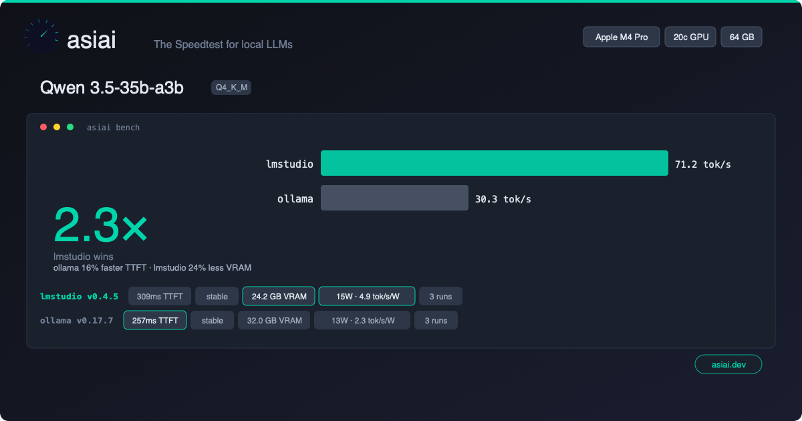

# Carte de benchmark

Partagez vos résultats de benchmark sous forme d'une belle image brandée. Une seule commande génère une carte que vous pouvez publier sur Reddit, X, Discord ou toute plateforme sociale.

## Démarrage rapide

```bash
asiai bench --quick --card --share    # Bench + carte + partage en ~15 secondes
asiai bench --card --share            # Bench complet + carte + partage
asiai bench --card                    # SVG + PNG sauvegardés localement
```

## Exemple



## Ce que vous obtenez

Une **carte sombre de 1200x630** (format OG image, optimisé pour les réseaux sociaux) contenant :

- **Badge matériel** — votre puce Apple Silicon mise en avant (en haut à droite)
- **Nom du modèle** — quel modèle a été benchmarké
- **Comparaison des moteurs** — graphique en barres style terminal montrant les tok/s par moteur
- **Mise en avant du gagnant** — quel moteur est le plus rapide et de combien
- **Pastilles de métriques** — tok/s, TTFT, note de stabilité, utilisation VRAM
- **Branding asiai** — logo + badge « asiai.dev »

Le format est conçu pour une lisibilité maximale lorsqu'il est partagé en miniature sur Reddit, X ou Discord.

## Comment ça fonctionne

```
asiai bench --card --share
        │
        ▼
  ┌──────────┐     ┌──────────────┐     ┌──────────────┐
  │ Benchmark │────▶│ Générer SVG  │────▶│  Sauvegarder  │
  │  (normal) │     │  (zéro-dep)  │     │ ~/.local/     │
  └──────────┘     └──────┬───────┘     │ share/asiai/  │
                          │             │ cards/         │
                          ▼             └──────────────┘
                   ┌──────────────┐
                   │ --share ?    │
                   │ Soumettre    │
                   │ bench + PNG  │
                   └──────┬───────┘
                          │
                          ▼
                   ┌──────────────┐
                   │ URL parta-   │
                   │ geable + PNG │
                   │ téléchargé   │
                   └──────────────┘
```

### Mode local (par défaut)

SVG généré localement avec **zéro dépendance** — pas de Pillow, pas de Cairo, pas d'ImageMagick. Du pur templating Python. Fonctionne hors ligne.

Les cartes sont sauvegardées dans `~/.local/share/asiai/cards/`. Le SVG est parfait pour un aperçu local, mais **Reddit, X et Discord nécessitent du PNG** — ajoutez `--share` pour obtenir un PNG et une URL partageable.

### Mode partage

Combiné avec `--share`, le benchmark est soumis à l'API communautaire, qui génère une version PNG côté serveur. Vous obtenez :

- Un **fichier PNG** téléchargé localement
- Une **URL partageable** sur `asiai.dev/card/{submission_id}`

## Cas d'utilisation

### Reddit / r/LocalLLaMA

> « Je viens de benchmarker Qwen 3.5 sur mon M4 Pro — LM Studio 2.4x plus rapide qu'Ollama »
> *[joindre l'image de la carte]*

Les publications de benchmark avec images obtiennent **5 à 10x plus d'engagement** que les publications textuelles.

### X / Twitter

Le format 1200x630 est exactement la taille OG image — il s'affiche parfaitement en aperçu de carte dans les tweets.

### Discord / Slack

Déposez le PNG dans n'importe quel canal. Le thème sombre assure la lisibilité sur les plateformes en mode sombre.

### GitHub README

Affichez vos résultats de benchmark personnels dans votre README de profil GitHub :

```markdown

```

## Combiner avec --quick

Pour un partage rapide :

```bash
asiai bench -Q --card --share
```

Cela lance un seul prompt (~15 secondes), génère la carte et partage — parfait pour des comparaisons rapides après l'installation d'un nouveau modèle ou la mise à jour d'un moteur.

## Philosophie de conception

Chaque carte partagée inclut le branding asiai. Cela crée une **boucle virale** :

1. L'utilisateur benchmarke son Mac
2. L'utilisateur partage la carte sur les réseaux sociaux
3. Les spectateurs voient la carte brandée
4. Les spectateurs découvrent asiai
5. De nouveaux utilisateurs benchmarkent et partagent leurs propres cartes

C'est le [modèle Speedtest.net](https://www.speedtest.net) adapté à l'inférence LLM locale.
