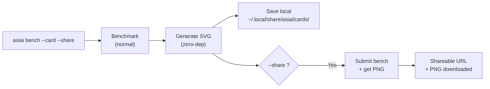

# 벤치마크 카드

벤치마크 결과를 아름다운 브랜드 이미지로 공유하세요. 하나의 명령어로 Reddit, X, Discord 또는 기타 소셜 플랫폼에 게시할 수 있는 카드를 생성합니다.

## 빠른 시작

```bash
asiai bench --quick --card --share    # 벤치마크 + 카드 + 공유 약 15초
asiai bench --card --share            # 전체 벤치마크 + 카드 + 공유
asiai bench --card                    # SVG + PNG 로컬 저장
```

## 예시


## 결과물

**1200x630 다크 테마 카드** (OG 이미지 포맷, 소셜 미디어 최적화):

- **하드웨어 배지** — Apple Silicon 칩이 눈에 띄게 표시 (우측 상단)
- **모델 이름** — 벤치마크된 모델
- **엔진 비교** — 터미널 스타일 막대 차트로 엔진별 tok/s 표시
- **승자 하이라이트** — 어떤 엔진이 더 빠르고 얼마나 차이나는지
- **메트릭 칩** — tok/s, TTFT, 안정성 등급, VRAM 사용량
- **asiai 브랜딩** — 로고 마크 + "asiai.dev" 필 배지

이 포맷은 Reddit, X, Discord에서 썸네일로 공유할 때 최대 가독성을 위해 설계되었습니다.

## 작동 방식



### 로컬 모드 (기본값)

SVG는 **의존성 제로**로 로컬 생성 — Pillow 불필요, Cairo 불필요, ImageMagick 불필요. 순수 Python 문자열 템플릿. 오프라인 동작.

카드는 `~/.local/share/asiai/cards/`에 저장됩니다. SVG는 로컬 미리보기에 적합하지만 **Reddit, X, Discord에서는 PNG가 필요** — `--share`를 추가하면 PNG와 공유 URL을 받을 수 있습니다.

### 공유 모드

`--share`와 결합하면, 벤치마크가 커뮤니티 API에 제출되고 서버 측에서 PNG 버전이 생성됩니다. 결과물:

- 로컬에 다운로드된 **PNG 파일**
- `asiai.dev/card/{submission_id}`의 **공유 URL**

## 사용 사례

### Reddit / r/LocalLLaMA

> "M4 Pro에서 Qwen 3.5을 벤치마크했는데 — LM Studio가 Ollama보다 2.4배 빨랐어요"
> *[카드 이미지 첨부]*

이미지가 포함된 벤치마크 게시물은 텍스트만 있는 게시물보다 **5-10배 더 많은 참여**를 얻습니다.

### X / Twitter

1200x630 포맷은 정확한 OG 이미지 크기 — 트윗에서 카드 미리보기로 완벽하게 표시됩니다.

### Discord / Slack

아무 채널에나 PNG를 드롭하세요. 다크 테마로 다크 모드 플랫폼에서의 가독성을 보장합니다.

### GitHub README

GitHub 프로필 README에 개인 벤치마크 결과를 표시:

```markdown

```

## --quick과 결합

빠른 공유를 위해:

```bash
asiai bench -Q --card --share
```

단일 프롬프트로 실행 (~15초), 카드를 생성하고 공유 — 새 모델 설치나 엔진 업그레이드 후 빠른 비교에 적합합니다.

## 디자인 철학

모든 공유 카드에는 asiai 브랜딩이 포함됩니다. 이를 통해 **바이럴 루프**가 생성됩니다:

1. 사용자가 Mac을 벤치마크
2. 사용자가 소셜 미디어에 카드를 공유
3. 뷰어가 브랜드 카드를 봄
4. 뷰어가 asiai를 발견
5. 새 사용자가 벤치마크하고 자신의 카드를 공유

이것은 로컬 LLM 추론에 적용된 [Speedtest.net 모델](https://www.speedtest.net)입니다.
