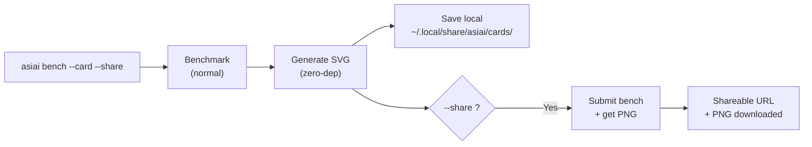

# Benchmark Card

Compartilhe seus resultados de benchmark como uma imagem bonita e com marca. Um comando gera um card que você pode postar no Reddit, X, Discord ou qualquer plataforma social.

## Início rápido

```bash
asiai bench --quick --card --share    # Bench + card + share em ~15 segundos
asiai bench --card --share            # Bench completo + card + share
asiai bench --card                    # SVG + PNG salvos localmente
```

## Exemplo


## O que você recebe

Um **card de tema escuro 1200x630** (formato OG image, otimizado para mídias sociais) contendo:

- **Badge de hardware** — seu chip Apple Silicon em destaque (canto superior direito)
- **Nome do modelo** — qual modelo foi testado
- **Comparação de engines** — gráfico de barras estilo terminal mostrando tok/s por engine
- **Destaque do vencedor** — qual engine é mais rápida e por quanto
- **Chips de métricas** — tok/s, TTFT, classificação de estabilidade, uso de VRAM
- **Marca asiai** — logo + pill badge "asiai.dev"

O formato é projetado para máxima legibilidade quando compartilhado como miniatura no Reddit, X ou Discord.

## Como funciona



### Modo local (padrão)

SVG gerado localmente com **zero dependências** — sem Pillow, sem Cairo, sem ImageMagick. Pure Python string templating. Funciona offline.

Os cards são salvos em `~/.local/share/asiai/cards/`. SVG é perfeito para visualização local, mas **Reddit, X e Discord exigem PNG** — adicione `--share` para obter um PNG e uma URL compartilhável.

### Modo compartilhamento

Quando combinado com `--share`, o benchmark é enviado à API comunitária, que gera uma versão PNG no servidor. Você recebe:

- Um **arquivo PNG** baixado localmente
- Uma **URL compartilhável** em `asiai.dev/card/{submission_id}`

## Casos de uso

### Reddit / r/LocalLLaMA

> "Acabei de testar o Qwen 3.5 no meu M4 Pro — LM Studio 2.4x mais rápido que o Ollama"
> *[anexar imagem do card]*

Posts de benchmark com imagens recebem **5-10x mais engajamento** que posts somente texto.

### X / Twitter

O formato 1200x630 é exatamente o tamanho OG image — exibe perfeitamente como preview de card em tweets.

### Discord / Slack

Solte o PNG em qualquer canal. O tema escuro garante legibilidade em plataformas com modo escuro.

### GitHub README

Exiba seus resultados pessoais de benchmark no README do seu perfil GitHub:

```markdown

```

## Combinar com --quick

Para compartilhamento rápido:

```bash
asiai bench -Q --card --share
```

Executa um único prompt (~15 segundos), gera o card e compartilha — perfeito para comparações rápidas após instalar um novo modelo ou atualizar uma engine.

## Filosofia de design

Todo card compartilhado inclui a marca asiai. Isso cria um **ciclo viral**:

1. Usuário faz benchmark do seu Mac
2. Usuário compartilha o card nas redes sociais
3. Visualizadores veem o card com marca
4. Visualizadores descobrem o asiai
5. Novos usuários fazem benchmark e compartilham seus próprios cards

Este é o [modelo Speedtest.net](https://www.speedtest.net) adaptado para inferência LLM local.
