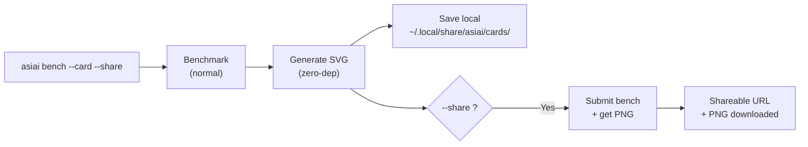

# 基准测试卡片

将你的基准测试结果分享为精美的品牌图片。一条命令即可生成可以发布到 Reddit、X、Discord 或任何社交平台的卡片。

## 快速开始

```bash
asiai bench --quick --card --share    # 测试 + 卡片 + 分享，约 15 秒
asiai bench --card --share            # 完整测试 + 卡片 + 分享
asiai bench --card                    # SVG + PNG 本地保存
```

## 示例


## 卡片内容

一张 **1200x630 暗色主题卡片**（OG 图片格式，针对社交媒体优化），包含：

- **硬件徽章** — 显眼展示你的 Apple Silicon 芯片（右上角）
- **模型名称** — 测试了哪个模型
- **引擎对比** — 终端风格柱状图展示每个引擎的 tok/s
- **冠军高亮** — 哪个引擎更快及快多少
- **指标标签** — tok/s、TTFT、稳定性评级、VRAM 占用
- **asiai 品牌** — logo 标志 + "asiai.dev" 圆角标签

该格式设计为在 Reddit、X 或 Discord 上作为缩略图分享时具有最佳可读性。

## 工作原理



### 本地模式（默认）

SVG 在本地生成，**零依赖**——无需 Pillow、Cairo 或 ImageMagick。纯 Python 字符串模板。可离线使用。

卡片保存到 `~/.local/share/asiai/cards/`。SVG 适合本地预览，但 **Reddit、X 和 Discord 需要 PNG**——添加 `--share` 获取 PNG 和可分享链接。

### 分享模式

配合 `--share` 使用时，基准测试会提交到社区 API，服务端生成 PNG 版本。你将获得：

- 本地下载的 **PNG 文件**
- `asiai.dev/card/{submission_id}` 的**可分享链接**

## 使用场景

### Reddit / r/LocalLLaMA

> "刚在 M4 Pro 上测试了 Qwen 3.5——LM Studio 比 Ollama 快 2.4 倍"
> *[附上卡片图片]*

带图片的基准测试帖子比纯文本帖子获得 **5-10 倍的互动量**。

### X / Twitter

1200x630 格式正是 OG 图片尺寸——在推文中完美显示为卡片预览。

### Discord / Slack

在任何频道中发送 PNG。暗色主题确保在深色模式平台上的可读性。

### GitHub README

在 GitHub 个人资料 README 中展示你的基准测试结果：

```markdown

```

## 配合 --quick 使用

快速分享：

```bash
asiai bench -Q --card --share
```

运行单个提示词（约 15 秒），生成卡片并分享——非常适合安装新模型或升级引擎后的快速对比。

## 设计理念

每张分享的卡片都包含 asiai 品牌。这创造了一个**病毒传播循环**：

1. 用户对自己的 Mac 做基准测试
2. 用户在社交媒体分享卡片
3. 观看者看到品牌卡片
4. 观看者发现 asiai
5. 新用户做基准测试并分享自己的卡片

这是 [Speedtest.net 模式](https://www.speedtest.net)在本地 LLM 推理领域的应用。
